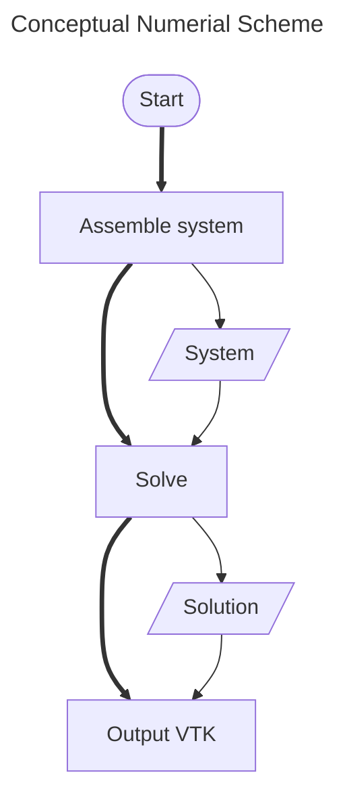

The Poisson equation is a partial differential equation that models the
distribution of charge in a region. It is a second-order partial differential equation that can be written in the form :

> $$\Delta \phi = \rho$$

