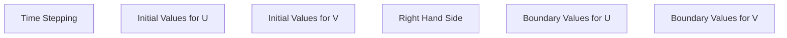

```yaml
meshes:
    mesh:
        type: hyper_cube
        range: -1 .. 1
        subdivisions: 5

equations:
    wave: diff(u, t, 2) - c**2 * Laplacian(u) = f

time: 0 .. 5

finite_elements:
    fe: Q_1

parameters:
    c: 1

functions:
    f: 
    g: 
    u0: 
    u1:
    

```
