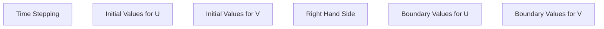

i need to be able to convert equations to compute code

```yaml
meshes:
    mesh:
        type: hyper_cube
        range: -1 .. 1
        subdivisions: 5

equations:
    equation: d²u / dt² - Laplacien(u) = f

finite_elements:
    fe: Q_1

functions:
    f: 
    g: 
    u0: 
    u1:
    

```
