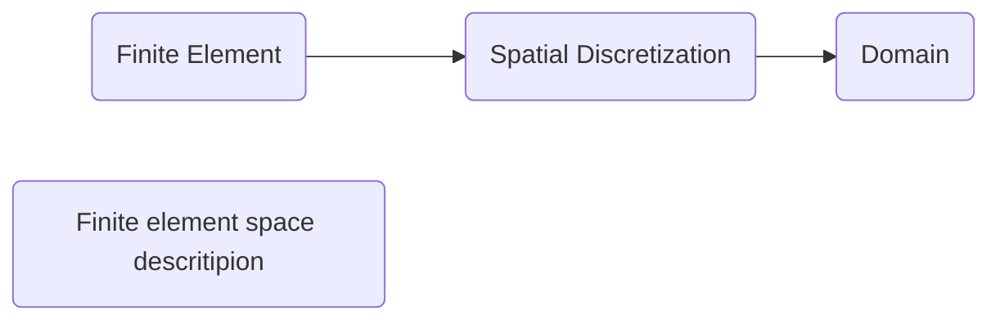

## FEM (Finite Element Method)
1. Define the problem
    - Material properties, boundary conditions, initial conditions
2. Discretize the domain
    - Element types, mesh generation
3. Define element matrices (software)
4. Assemble global matrix (software)
5. Solve  (software)
    - iterative solvers 
        - conjuguate gradient method (only works for symetric and positive definites, which can be inferred from the equation)
        - general
            - BICGStab 
            - GMRES
    - direct solver
6. Post-process results, Validate results

## FVM (Finite Volume Method)
- computational domain
- mesh
- discretization of equations
- solution of system of algebraic equations

