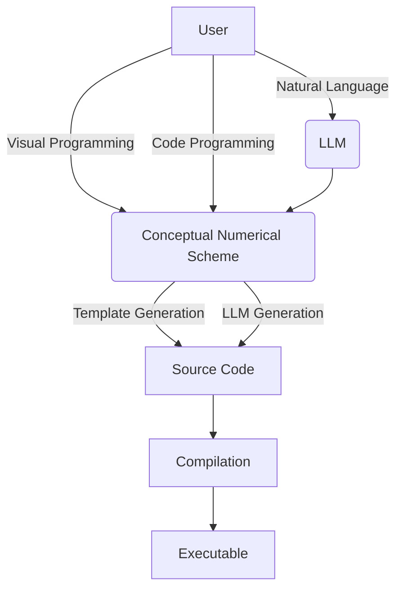

A distinctive feature of this library, compared to other PDE simulation libraries, is its innovative
use of AI for automating code generation. This approach significantly enhances user-friendliness, with
the end goal of only requiring problem definition from the user.

The first approach that is researched is the following :

1. The user (or an AI from a user-supplied natural language problem description) provides a conceptual graph describing the numerical scheme (problem definition, numerical method(s),
time stepping...)
2. This conceptual graph is systematically transformed into actual source code, which is then compiled into an optimized executable program for HPC (High-Performance Computing).

This approach allows for great flexibility, while retaining performance as the end result is an executable optimized for only one problem. It avoids the traditional costs incurred by abstraction and polyvalence.

It is yet undecided if the resulting executable will support changing the values of parameters, or if a new compilation will occur. The choice will depend on the potential performance gains procured by statically linking parameter values.

## Implementation
### Template-based source code generation
### LLM-based source code generation

