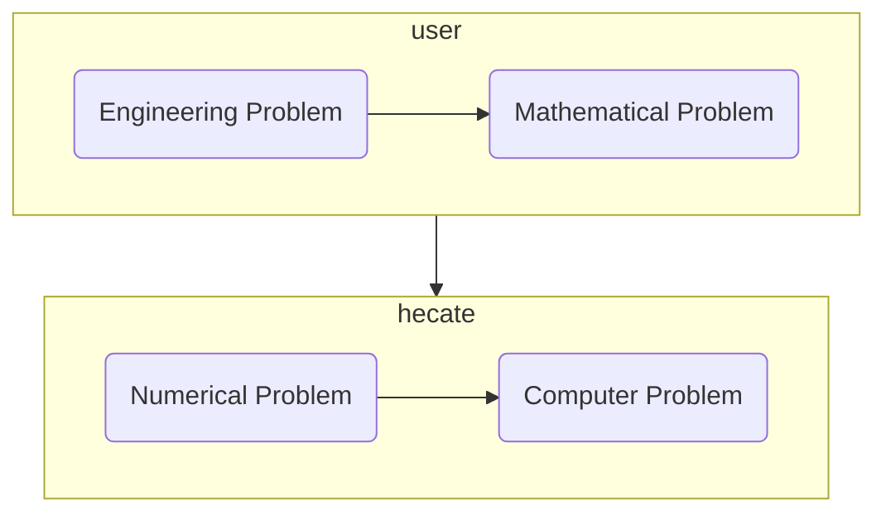

#### Numerical modeling
Applying a numerical method to a real world problem typically goes through the 4 following problem definition: 

## Design Goals
- easy to use
- separate problem definition and implementation
- runtime flexibility
    - multiple backends for the different components (mesh generation, PDE solvers, etc.)

## Features
- modular design with building blocks
- graphical user interface
- ai powered generation
